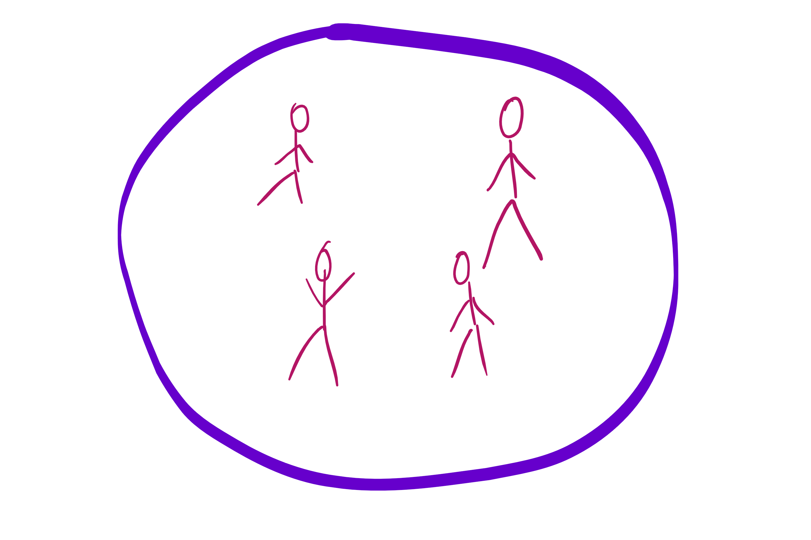
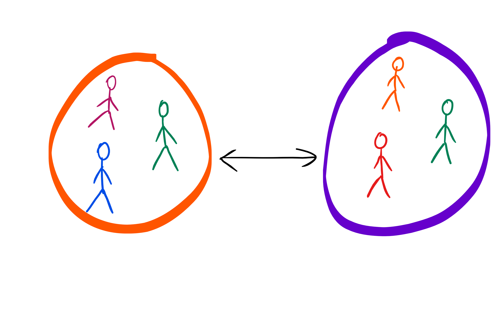
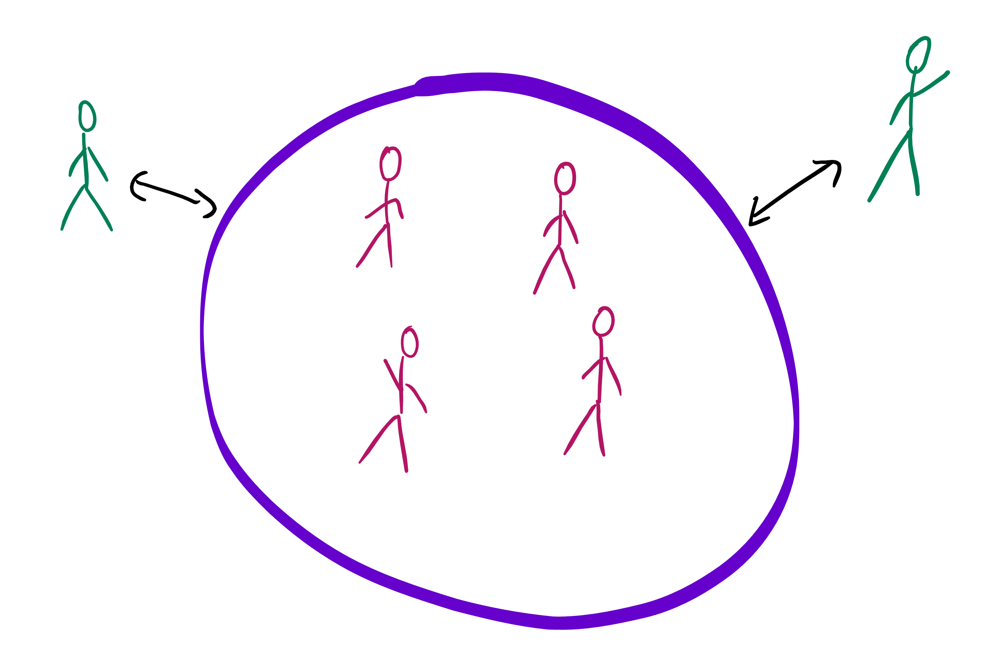

# The concept of remote working
## What is it about?
### Some definitions

- [Martin Fowler](https://martinfowler.com/articles/remote-or-co-located.html): geographies of remote teams:

single-site team:

multi-site team:

satellite workers:

remote-first team:

- Remote = "everything outside of this floor", doesn't matter if India or coffee shop around the corner - "out is out"
- not just local changes, also temporal changes, for example opposite of "9 to 5" = "My company gets the premium 8 hours of my day where I can focus the most."

### Current status in the industry

- "The future is already here - it's just not evenly distributed" (William Gibson) - what we're talking about here is the present. Don't let anybody tell you "maybe in the future".

- Companies with remote workers: ebay, IBM, Accenture (see "Remote" p. 80)
- However: some important tech companies prefer co-located work: [Yahoo](https://www.fastcompany.com/3020930/yahoo-says-that-killing-working-from-home-is-turning-out-perfectly), Google, Netflix. 
- There's no works-for-all solution, applying working remotely depends on circumstances. 
- only applies to knowledge workers with creative and thoughtful work
- offices = invention from the 18th and 19th century
- nowadays, at least for knowledge workers, office = perceived as interruption factory
- "real work" is done alone in the quite / in coffee shops
- 400h commute time per year = time to develop "basecamp" (https://launchpad.37signals.com/basecamp)
- relatively new concept because technology only available since a couple of years: internet, cheap fast portable computers, webcamps, headsets, ...
- provoking thought: "As a good developer, these days you have to be able to work remotely"

## Remote working has to be learned and is not for everyone

- new possibility of distributed work doesn't mean that every team should be remote!
- distributed work != faster / better than co-located work
- in many cases: gather developers around one desk = maximum performance because of quick communication paths + no technical and organizational overhead
- also: remote working may make only sense with developers, not management or assistance (although there are digital assistants ...)
- doesn't work in with every customer, every team member etc.
- high level of self discipline necessary, high level of seniority, high level of self-organization: "What is the next thing I have to to to be successful?"
- experience from senior colleague: "You cannot work remotely in the first years of your career". Best thing: work co-located, then remote.
- also holds true for remote teams: Start working co-located in one room for a while, only after that separate and work remotely.
- "Everything that can go wrong in co-located mode can go REALLY REALLY wrong in remote-mode" (Martin Scholz)
- remote working is learnable and has to be learned
- focus of this workshop: cases, where distributed working is reality. 

## Reputation

- employees: Wanna have!
- employers: (often) no-go
- "good ideas only when you are all in one room" - compare to several (american) films where crisis squads lock themselves into a room and force a solution
- big topic: trust. Employer "How can I trust them to work?" - Why would you want to work for a boss that doesn't trust you? Why would he want to hire people he can't trust? Real fear: Loss of control, power, influence, right of existence of some managers
- security: What is more valuable: An encrypted laptop or a demotivated emplyoer? Knowledge is in the heads, not the hardware. However, "safe" VPN and infrastructure is necessary. security checklist of 37signals:
  - all computers drive encryption
  - disable automatic login + logout after 10 minutes
  - encryption for every site visited (TLS)
  - all smart phones and laptops have lock codes and can be wipped remotely
  - only use generated passwords that are managed via password safe
  - two factor authentication (additional dongle or app for pin)
- Change of mindset: working remotely != "cheaper", but "We as tech-leaders need the best workers from around the world!" - that's an additional dimension to "think remote"
 
## Consequences
### If it works
- employer:
  - only gets the most productive hours
  - in comparison to 9 to 5: employer pays for sitting on chair in a specific time slot
  - gets the best of the best - worldwide => opposite of "Let's do remote, it's cheaper!" because great software craftsmen will cost money, regardless of where they are.
  - ("Remote" p. 31) "Working outside the Box", IBM white paper, 2009: 1,9 billion $ from selling office space + > 1 billion $ less leasing per year
  - chance to keep employees who move due to family reasons
- employee:
  - choosing when to "work": only invoice most productive hours, sleep / play / go shopping in the meantime
  - "new luxury": go surfing everyday while working for a company in Norway instead of the nice loft in the city of your employer.
  - ("Remote" p. 32) telecommuter 10.000$ per year less costs for commuting

### If it doesn't work
- employee invoices his long lunch breaks and idle time
- think: What would an employer most likely notice: the third consecutive missed deadline because of laziness or a friendly, ever-present employee who doesn't do anything?
- remote working focuses on the work done, not how you can sell yourself with chitchat in the office.

### new information age "industrialization"
- during industrialization: growth of cities (because that's where factories are)
- during information age: working from your cabin in the woods (with satellite internet)

## Variations
- remote work != another country / continent. Imagine just working part time and not driving to work for just 3 hours.
- working from onsite (location of customer) = working from inside the office = working from home
- => remote = state of mind. Enable it and see what happens!

## Current situation in Germany
- more and more need for nearshore (for example Romania) or offshore (for example China or India) in Germany
- reason: cost reduction from german industry
- consequence in german IT: customer contact, analysis and creation of requirements furthermore in Germany, also decision-making about architectures and technologies. Implementation however more and more offsite.
- => more need for coordination and communication in management
- more need for understanding business logic for every consultant in Germany

## What does that mean to you?

- You will be compared to people from all over the world. Find your niche and be awesome!
- Employers will hire people who write well. Learn that!
- It's more and more about communication. Visit every communication course you can, especially when being a student.
