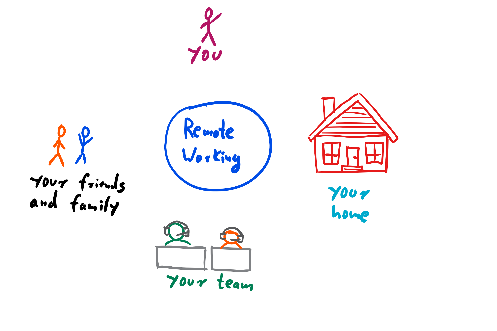

# How to make it work

## Prepare yourself

- Warning: Not for everyone! Remember time right before your final tests? Bet your rooms have never been that clean. ;) Beware of procrastination!
- Don't get flabby: when working from home, no more walks to the cafeteria and less traveling to the water cooler = health issues! 
- dress properly, even if no one sees you (activate "working-mode" in brain)
- more subtle: working-slippers

## Prepare your social context

- Proactively fight social isolation
- find your way to connect to your remote team
- know all holidays of the countries your teammates work in and make them public to everyone in the team

## Prepare your home
- invest in a proper office
- have a "real" office, not just a corner in your living room
- prepare your family - they will be sharing your office with you
- introduce no-go zones and timeslots
- introduce signs like closed doors or "Leave me alone working"-signs
- pay attention to what is happening in your video stream: presentation for customers in a clean room without personal stuff visible. Presentation for team: cat running on the desktop great, creates personal touch

## Prepare your team
- overlapping timezones
- declare "default-timezone". What is meant with "Let's meet at 8 a.m.?"
- virtual water cooler
- force employees to stop working: "Just checking mails right after dinner with my family" very dangerous
- language:
    - train the commonly used language with ongoing language courses. 
    - slang + phrases very important "Can you rephrase that please?", "Oh, bummer, person x is missing" + english designations important ("mobile phone", not "handy")
    - One of our teams in india: "indien english" only spoken by employees > 50 years. Young people: "Hollywood-english" because of strong influence of american movie industry.
    - in India: teammates even speak english to each other because they originate from different areas in India and speak very different dialects. 
- everyone involved must be a pro in communication because a big part of inter-human communication is not available remotely (gesture, facial expression, surroundings, smell, hearing everything, ...) + everyone must know how to communicate expectations to others
- learn how to write emails ("I'm sorry this mail is so long, I couldn't take the time to shorten it") and leave voice messages ("Influencing virtual teams" p. 44)
- learn how to organize meetings (necessary? goal, agenda, participants, postprocessing)
- organize a coach for first-time remote-working teams. For example: learn how to screenshare: don't move the mouse unless you want to point to something, navigatore more slowly, speak as if you're giving an interview
- cultural differences
    - coaching of communication of cultural differences and how to deal with them (for example different understand of what "9 am" means: "Indian time" or "German time"?)
    - different situation of workforce: in India, young and well-studied employees very detailed wishes about tasks and carrier, will switch employer very fast. Good countermeasure: give responsibility and interesting tasks => project leads have to know this!   
- at least teamleaders, better everyone in the team has to be coached in solving conflicts because these are harder to solve from distance
- in case of multi-site teams: "us vs them"-mentality can occur. Vaccine: Regular meetings + ambassadors = build personal relationships = plan time for common relaxing activities (visit location of other team, sightseeing of offices and interesting locations in the city, eat together, finish with a beer in a bar).
- ambassador = team member who spend some weeks / months at the remote site
- special case: multi-site team. Every team should be "full-stack" = being able to do every task another team could do. => cross-functional teams! Creating functional / layered teams (test-team in Berlin, developer-team in Romania) bad idea because communication paths within one layer already strong.
- satellite workers generally bad idea, at best just temporarily
- every team needs self-defined rules -> first kickoff-meeting with team 

## Prepare your processes
- have a real-life meeting at the beginning of the project = "invest in beginnings": freshly created remote working teams need more time for the "storming" phase in which roles and rules are created. This time has to be accounted for and planned upfront.
- with that first meeting: begin to build trust
- "You don't remember Skype-Meetings. But you remember when the team met in real-life." (Iulia)
- don't stop there: trust has to be groomed and buid further
- have a look at open source projects: all remote, a lot of them are awesome and used worldwide. These are endlessly more complex than most of the "business" applications you will work on.
- if only part of team remote: treat them like equals because they are equals! Get rid of technical impediments, improve social skills of the whole (!) team, meet in person.
- employers: organize meetups at least 2 times a year, multiple days. People have to meet in person! Have activities for working together, meeting the customer together, having fun together. See https://stevenschwenke.de/theFirstGetTogetherOfMeAndMyRemoteTeam
- complete transparency (especially for documents). There's no "just go over to Sven and ask him" because Sven is in Helsinki and sleeping right now.
- way more documentation of the processes used - leads automatically to more professional development!
- use an agile process with daily meetings and self-organizing teams
- decide if you want to "just throw over" predefined packages of work or if you want to be a real team where everyone is equal
- special case: remote-first: "If you're going with a remote-first model, you need to go all-out with it. All communication should occur online, don't have co-located sub-groups in the same office. I've even heard of some teams forcing people working in the same office to working in solitary offices and mandating that any communication with the programmer next door occurs online.", [Martin Fowler](https://martinfowler.com/articles/remote-or-co-located.html)

## Prepare your customer
- invite the customer to web meetings to build trust. "Seeing is believing", that goes for your coworkers as well!
- make team structure very transparent
- provide understanding of holidays, special cultural situations etc. for customer. Example: Romania started to create new holidays in 2017 to "adapt" to EU. Interesting and funny material to talk about with the whole team and the customer!   

## Prepare your company
- "The fact that you can get a better team by supporting a remote working pattern has become increasingly important during my time in the software business and I expect its importance to keep growing. I sense a growing reluctance amongst the best developers to accept the location and commuting disadvantages of single-site work. This is increasingly true as people get more experienced, and thus more valuable. You can either try to ignore this and accept the best people who will relocate for you, or you can explore how to make remote working patterns more effective. I think that organizations that are able to make remote working patterns effective will have a significant and growing competitive advantage.", [Martin Fowler](https://martinfowler.com/articles/remote-or-co-located.html)

# Exercises
## War Gaming: Office exodus
- scenario: The office burned down and everybody has to work from home.
- Task 1: Create a prioritized list of things that could make this transition difficult for you. Add at least one thought to each of the aspects presented in this chapter (you, your friends and family ...). 
- Task 2: For each of the problems in your first list, create a list of specific tasks you have to do to counter these negative effects. A task is a small and physically doable step. If there are a lot of tasks, you may create projects (= tasks done in a specific order to reach a goal).
- because these thoughts can be very intimate, presentation is optional and voluntary.
- organizational:
    - task 1: 10 minutes
    - task 2: 20 minutes
    - presentation: 5 mins per participant
