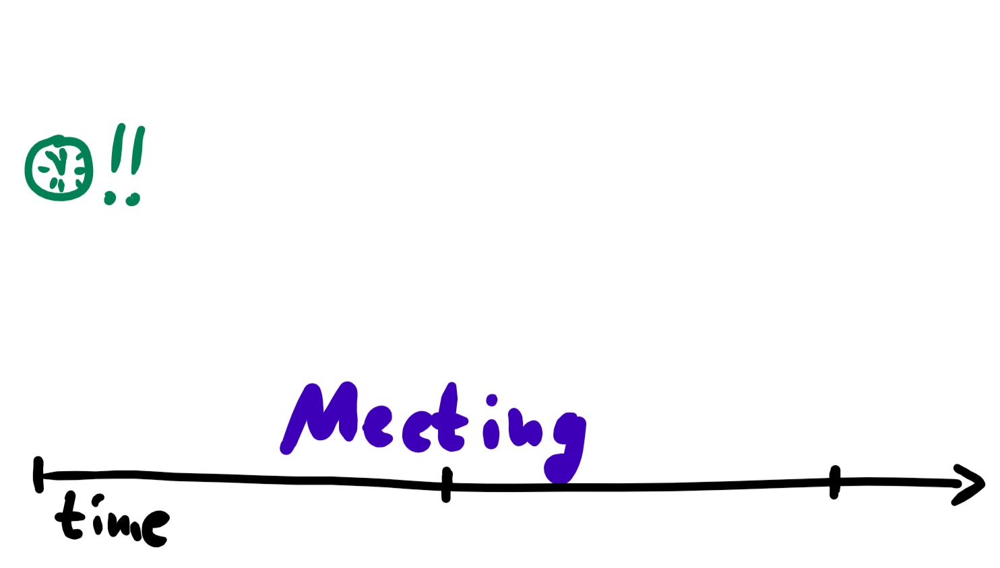
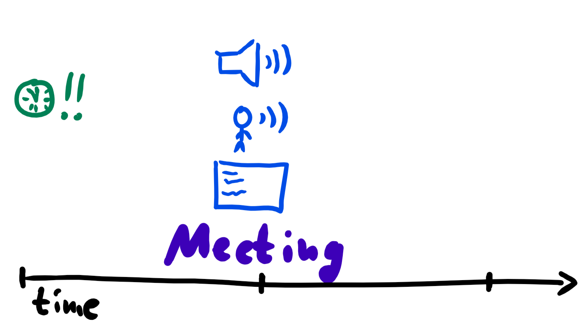
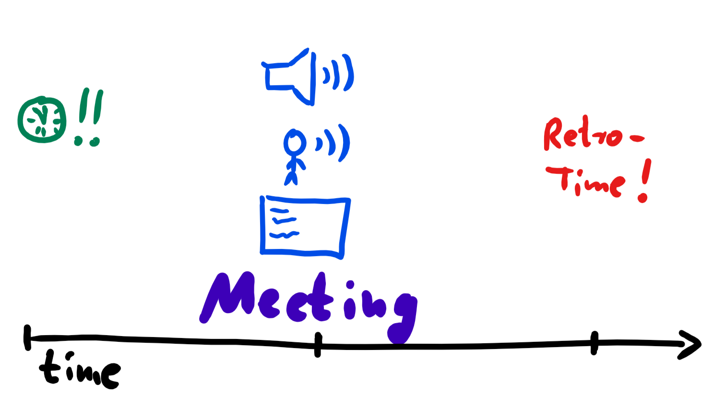
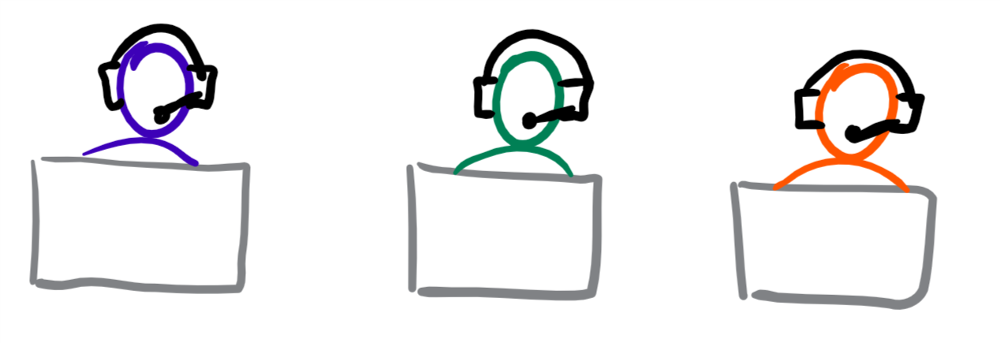

# Moderating remote meetings
- every meeting needs moderator role, especially remote meeting
- [a conference call in real life (youtube, 4:04)](https://www.youtube.com/watch?v=DYu_bGbZiiQ)
- no long presentations without interactions of participants. Develop drawings etc. during presentation to create involvement and action

## phases of a meeting

Moderator should know the phases every meeting should have:
1. Beginning and smalltalk => check list of participants, create setting, let everybody speak
2. Introduction = Warmup, present goals of the meeting, explain structure and rules to follow (like "mute your mic if not speaking")
3. Visualized content. Activate participants per direct speech, proactively get feedback
4. Wrap up and tasks: Get agreement about the content of the meeting
5. Closing
6. Postprocessing and retrospective "What was good, what can be done better next time?"

## Moderator before the meeting

- moderator has several tasks before, during and after a meeting:

- being on time one of the most important things when working remotely
- to be ready for unforeseen events: login at least 15 minutes before meeting begin (remaining time can be used with muted mic)
- makes everyone else join at least 5 minutes before begin

## Moderator at the meeting

- introduces meeting with "Can everybody here me?" => "Yes" from everyone = confirmation that audio is great. Also great: thumbs up / down = immediate synchronous response from everybody
- if participants don't usually meet in this constellation, make everybody talk a little via simple questions like "Everybody had a great weekend?", "What's your favorite color/food/whatever?". Background: Surgeons do this to minimize fear of talking during an operation. That way, nobody has a psychological fear of calling out problems. 
- checks video stream of everybody
- keeps an eye to the chat - that's the remaining way of communication for those who suffered audio failure
- makes everybody not speaking mute their microphones

## Moderator after the meeting

- retrospective of your role as a moderator, findings during the meeting-process, specific tasks for next time

## locations layout

- best practice every participant sitting before his/her own webcam
- only if that's not possible, use meeting room
- remote-sitting colleagues have to be cared about in a special way:
   - at the beginning, state names of people present
   - during meeting, comment on things happening ("Joe just came in and joined us", "Michael is drawing something on the flipchart")
   - moderator interrupts and eliminates auxiliary conversations in the meeting room (hard to understand and follow remotely)
   - always ask remote participants first (to keep them in the loop)
   - make everybody state their name when beginning to talk
- "ambassador-rule": in bigger meetings, use an ambassador who watches the chat for questions and comments. Moderator asks comoderator from time to time if something happened, ambassador interrupts moderator if urgent questions arise.
- when videochatting with multiple people, direct the camera to the person speaking. Alternatively, deactivate automatic zoom.

## Participants of virtual meetings
- in case of voice-only meeting AND participants not known to each other: makes everyone speaking tell their name: "This is Martin, I just wanted to add ..."
- "overcommunicate" ("overuse" body language, facial expressions and gestures to communicate all the time) 
- also overcommunicate in content: check + paraphrase what you heard: "This is Joe. Is it right that you said X, Y and Z? Just want to make sure I understood you." 
