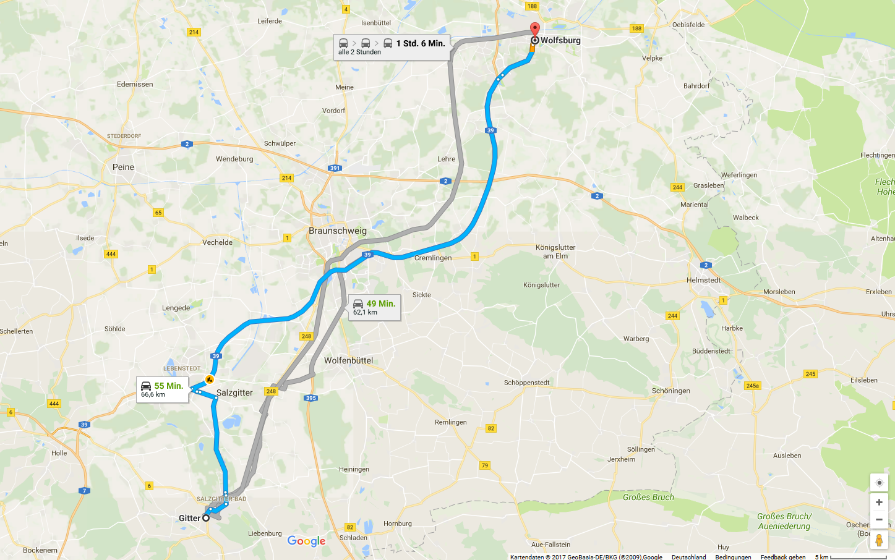
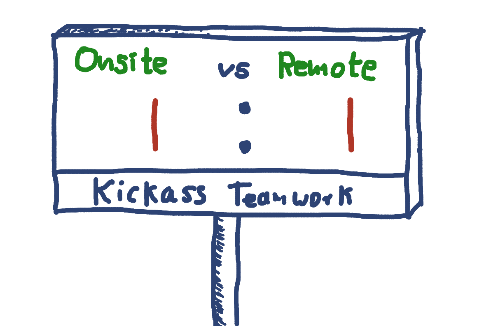

<!-- Chapter 00 -->
# Remote Working
## What it is, what it can be for your team and how to make it so

---

---

stevenschwenke.de

---

---

---

---

---

# What will be in this for you?
1. "theoretical" stuff
1. "practical stuff"
1. cross-talk

---

# Who are you?
- Are you currently working in a remote team?
- If yes, in what role?
- How big is your team?
- On how many locations is your team located?
- What are your main problems?
- What are your main questions?
- What are your main concerns?
 
---

# Chapter 1 - Concepts of remote working

---

---

## Single-site team

---

## multi-site team

---

## satellite workers

---

## remote-first team

---

---

---

---

---

---

# Chapter 2 - How to make it work

---

---

---

---

---

# Chapter 3 - Moderating remote meetings

---

---

---

---

---

---

# Chapter 4 - Tools

---

# Chapter 5 - Leading remote teams
.jpg)

---

---

---

---

---

---